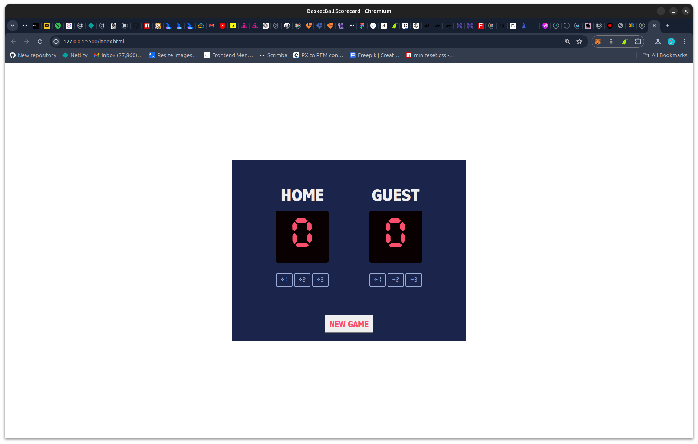

# Frontend Mentor - Social links profile solution

This is a solution to the [Basketball Scorecard Solo Project on Scrimba](https://scrimba.com/links/solo-project-basketball-scoreboard). Scrimba solo projects help you improve your coding skills by building realistic projects. 

## Table of contents

- [Overview](#overview)
  - [Screenshot](#screenshot)
  - [Links](#links)
- [My process](#my-process)
  - [Built with](#built-with)
- [Author](#author)

## Overview

### Screenshot

### Links

- Solution URL: [Github Repo](https://github.com/Achigyus/basketball-scorecard)
- Live Site URL: [Live Site](https://basketball-scorecard-achigyus.netlify.app/)

## My process

### Built with

- Semantic HTML5 markup
- CSS custom properties
- Flexbox
- Desktop-first workflow

## Author

- Website - [Achigyus](https://github.com/Achigyus)
- Frontend Mentor - [@Achigyus](https://www.frontendmentor.io/profile/Achigyus)
- Twitter - [@ElUchihaAnbu](https://www.twitter.com/ElUchihaAnbu)